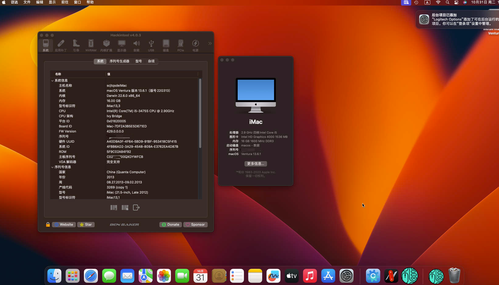

# dq77kb-i5-3475s-opencore-hackintosh

opencore + macos `ventura` (13.6.1) 的 efi 配置。基本上完美。

## 硬件配置

| 配件           | 型号                 | 说明               |
|--------------|--------------------|------------------|
| 主板           | Intel dq77kb       | 带intel amt的远程管理  |
| CPU          | i5-3475s           | 4核4线程    支持 Vpro |
| 内存           | 三星 ddr3 1600（笔记本）  | 8G * 2           |
| 显卡           | HD 4000            | DP * 1, HDMI * 1 |
| SSD          | 三星 1t ssd （引导+win） | msata            |
| 声卡           | APPLEALC仿冒         | 注入ID 1           |
| 有线网卡         | intel 82579LM（红）   | 千兆网卡             |
| 无线网卡         | intel 7260 ac      | github上的第三方驱动    |
| 电源           | DC电源               | DELL 120w        |
| 机箱           | SKTC M06           | 前面板音频ok          |
| hackintosh版本 | 13.6.1             | macos ventura    |

之前用的clover 引导,没什么问题。但是随着各种kext不再支持clover，因此迁移到opencore是一种趋势。

由于 mac `10.15` 很多app已经不兼容了。因此需要升级到 `big sur` + 版本。dq77kb最高也只能升级到 `big sur`
了，12的系统核显已经不支持了（需要单独打显卡补丁），这里做了能够在13系统下使用的配置，需要自行打oclp补丁

用我这个配置的话，自己记得改三码。 用 `occ（OpenCore Configurator)` 或者 `ocat(OCAuxiliaryTools)`重新生成一下就行。

用了intel的网卡，正好最近intel的驱动都有了，无论是wifi还是蓝牙！

支持从oc引导windows，并且不会造成设备混乱

## 关于在 macos 13(ventura) 下启动hd4000的核显驱动

1. 使用本仓库最新版本的efi配置
2. 去[OpenCore-Legacy-Patcher](https://github.com/dortania/OpenCore-Legacy-Patcher/releases/latest) 下载最新版本的oclp并安装
3. 打开oclp，点击`Post-Install Root Patch`，点击`Start Root Patching`。点击后进行重启，wifi就可以用了！

## BIOS设置

先把BIOS恢复到默认设置

+ 关闭串口，将configuration/onboard devices/serial prot修改为disable
+ 禁用 VT-d，将secuity/intel vt directed i/o修改为disable
+ 确保BIOS快速启动与安全启动关闭，显存大于128mb，SATA mode为AHCI，一般dq77kb恢复默认即可

## Win+Mac双系统解决Win系统时间时差问题

在Windows终端下使用管理员权限运行

```
Reg add HKLM\SYSTEM\CurrentControlSet\Control\TimeZoneInformation /v RealTimeIsUniversal /t REG_DWORD /d 1
```

## 设置默认启动项

    多系统在启动选择界面，先使用键盘移动到要启动的项，然后按Ctrl+Enter(回车键)进入系统，下次重启后默认就选中该项了

## 说明

主力机已更新为 [昂达 h410d4-ipc + 10500](https://github.com/scjtqs2/Hackintosh_ONDA-H410D4-IPC_15-10500_UDH630.git)。性能和dq77kb完全不是一个层次。。确实该升级了。

## 留图

